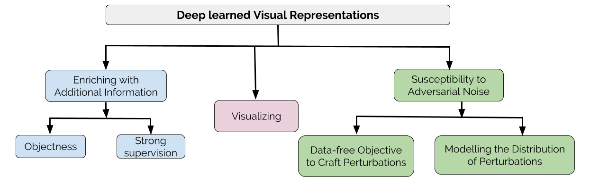

## About me
I am Konda Reddy Mopuri (కొండా రెడ్డి మోపూరి ), a PhD student advised by [Prof. R. Venkatesh Babu](http://www.serc.iisc.ernet.in/~venky/), at [Video Analytics Lab](http://val.serc.iisc.ernet.in/), Department of Computational and Data Sciences ([CDS](http://cds.iisc.ac.in/)), [Indian Institute of Science](http://iisc.ac.in), Bangalore, India.

My [CV](https://drive.google.com/file/d/0B03bwxgziaQydko0dmRFSkNxblE/view?usp=sharing) and [Google Scholar](https://scholar.google.com/citations?hl=en&user=OCZ2vIYAAAAJ)
## Research Interests
I work primarily in the areas of Computer Vision and Deep Learning. Lately I have been working on learning and understanding deep visual representations towards my PhD thesis.
## News

- April 11, 2018: Our paper with Vishal B Athreya is accepted in **[SPCOM-2018](http://ece.iisc.ernet.in/~spcom/2018/)**.
- February 19, 2018: Our paper with Utkarsh Ojha and [Utsav Garg](https://utsavgarg.github.io/) is accepted at **[CVPR-2018](http://cvpr2018.thecvf.com)**. The draft is available [here](https://arxiv.org/abs/1712.03390) and the project page is [here](http://val.serc.iisc.ernet.in/nag/).
- January 25, 2018: Our paper with [Aditya Ganeshan](https://www.linkedin.com/in/aditya-ganeshan-68341bb9/) titled "Generalizable Data-free Objective for Crafting Universal Adversarial Perturbations" is available in arXiv now [here](https://arxiv.org/abs/1801.08092) and the project page is [here](https://val-iisc.github.io/GD-UAP/).
- July 18, 2017: Paper with [Utsav Garg](https://utsavgarg.github.io/) titled “Fast Feature Fool: A data independent approach to universal adversarial perturbations” is accepted in **[BMVC-2017](https://bmvc2017.london)** and is available [here](https://arxiv.org/abs/1707.05572).

## Research

- Augmenting Deep Visual Representations with Side and Additional Information
- Visualizing the Deep Visual Representations
- Susceptibility of the Learned Representations to Adversarial Perturbations

## Publications

### 2018

- Konda Reddy Mopuri, Vishal B Athreya, R. Venkatesh Babu, "Learning Representations with Strong Supervision for Image Search", SPCOM 2018 (To be presented) [[Project](https://github.com/mopurikreddy/strong-supervision)].
- Konda Reddy Mopuri*, Utkarsh Ojha*, Utsav Garg and R. Venkatesh Babu, "NAG: Network for Adversary Generation, CVPR 2018 (To be presented in June)[[PDF](https://arxiv.org/abs/1712.03390)][[Project](http://val.serc.iisc.ernet.in/nag/)].

### 2017

- Konda Reddy Mopuri*, Utsav Garg* and R. Venkatesh Babu, "CNN-Fixations: An unraveling approach to visualize the discriminative image regions" arXiv preprint arXiv:1708.06670.
- Konda Reddy Mopuri*, Utsav Garg* and R. Venkatesh Babu, "Fast Feature Fool: A data independent approach to universal adversarial perturbations", BMVC 2017 [[PDF](https://arxiv.org/abs/1707.05572)][[Project](https://github.com/utsavgarg/fast-feature-fool)].

### 2016

- Konda Reddy Mopuri and R. Venkatesh Babu, "Towards Semantic Visual Representation: Augmenting Image Representation with Natural Language Descriptors", in ICVGIP 2016 [[PDF](http://delivery.acm.org/10.1145/3020000/3010010/a64-mopuri.pdf?ip=14.139.128.14&id=3010010&acc=ACTIVE%20SERVICE&key=045416EF4DDA69D9%2EDB7584019D0D7099%2E4D4702B0C3E38B35%2E4D4702B0C3E38B35&__acm__=1524563025_f2212122c0e205378dcb9c3bee0d6cff)].
- Suraj Srinivas, Ravi Kiran Sarvadevabhatla, Konda Reddy Mopuri, Nikita Prabhu, Srinivas S S Kruthiventi, R. Venkatesh Babu, "A Taxonomy of Deep Convolutional Neural Nets for Computer Vision", Frontiers in Robotics and AI, 2016 [[Link](http://journal.frontiersin.org/article/10.3389/frobt.2015.00036/full)].

### 2015

- Konda Reddy Mopuri, R. Venkatesh Babu, "Object Level Deep Feature Pooling for Compact Image Representation", in CVPRW, DeepVision 2015. [[Project](http://val.serc.iisc.ernet.in/oldf/)][[PDF](http://www.cv-foundation.org/openaccess/content_cvpr_workshops_2015/W03/papers/Mopuri_Object_Level_Deep_2015_CVPR_paper.pdf)].

## Test

    

    
<h2 id="textbook" style="font-size:25px;">News</h2>

<table class="table table-borderless" style="border-style:solid; border-width:1.2px;">
            <tbody>
            <!--FFD6BA-->

<tr>
    <td bgcolor="#FFD6BA" width="110">Apr 14, 2018</td>
    <td bgcolor="#FFD6BA" width="40"></td>
    <td bgcolor="#FFD6BA">Talk at <a href="https://www.iiit.ac.in/" target="_blank">IIIT-Hyderabad</a>.</td>
</tr>
<tr>
    <td width="110">Mar 7, 2018</td><td width="40"></td><td> Talk at <a href="https://www.cse.iitb.ac.in/webcal/view_entry.php?id=4502&date=20180307&user=_NUC_department" target="_blank">IIT-Bombay</a>.</td>
</tr>
<tr>
    <td width="110">Feb 19, 2018</td><td width="40"></td><td> Talk at  <a href="http://www.cse.iitd.ac.in/index.php/2011-12-29-23-14-40/talks-by-visitors" target="_blank">IIT-Delhi</a>.</td>
</tr>
<tr>
    <td width="110">Jan 29, 2018</td><td width="40"></td><td> I will be serving as a Program Committee member for <a href="https://www.ijcai-18.org" target="_blank">IJCAI-ECAI 2018</a>.</td>
</tr>
<tr>
    <td width="110">Jan 18, 2018</td><td width="40"></td><td> Talk at  <a href="https://research.adobe.com" target="_blank">Adobe Research</a>, Bangalore.</td>
</tr>
<tr>
    <td width="110">Nov 8, 2017</td><td width="40"></td><td> Paper accepted at <a href="https://aaai.org/Conferences/AAAI-18/">AAAI-2018</a>.</td>
</tr>
</tbody></table>

 

